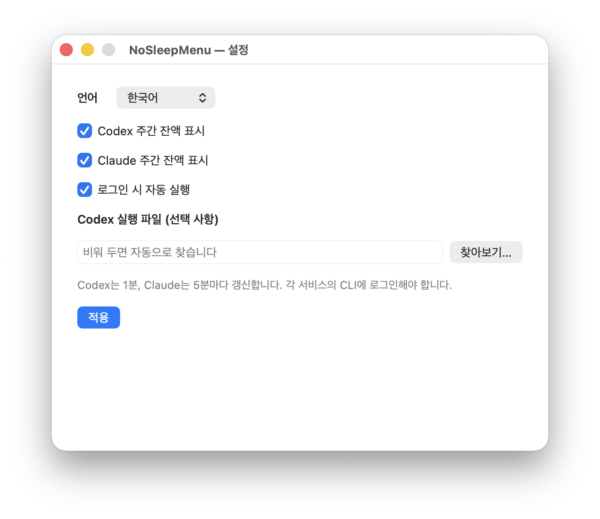
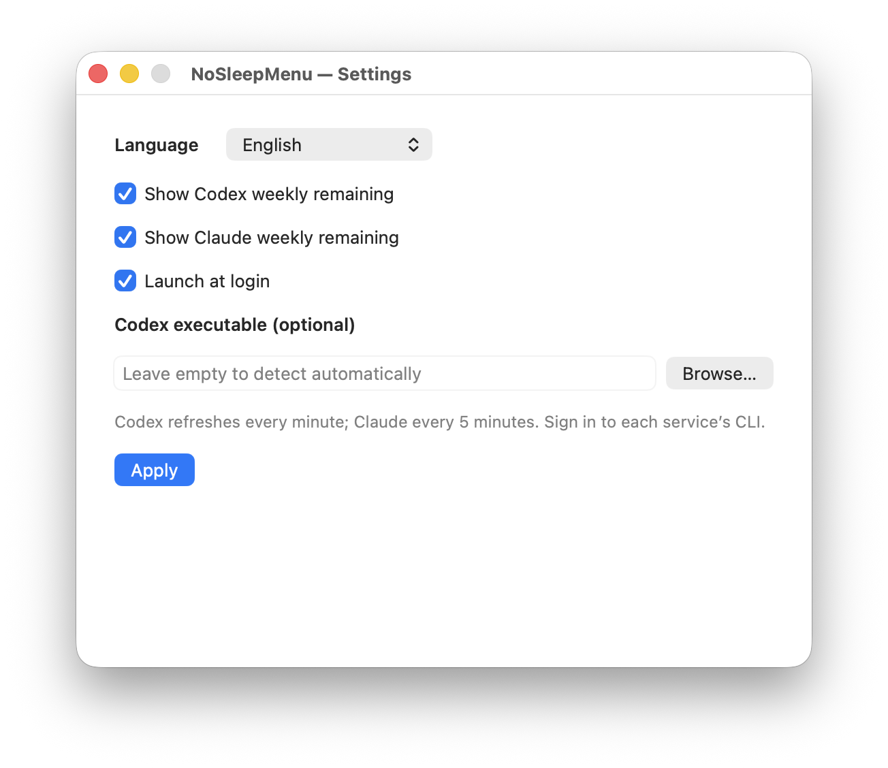

# NoSleepMenu

Mac의 잠자기 방지와 Codex·Claude 주간 사용 한도 잔액을 한 메뉴바에서 관리합니다.

[한국어](#한국어) · [English](#english) · [English-only README](README.en.md) · [다운로드](https://github.com/weavermensch92/NoSleepMenu/releases) · [MIT 라이선스](LICENSE)

## 한국어



### 기능

- **하나로 묶인 메뉴바 표시**: `Codex 잔액 % → ChatGPT 로고 → Claude 잔액 % → Claude 로고`. 두 서비스가 하나의 항목이므로 함께 이동합니다.
- 서비스별 표시 여부를 설정할 수 있습니다. 둘 다 숨기면 잠자기 상태를 나타내는 달 아이콘이 표시됩니다.
- 한국어 / English / 시스템 언어 자동 선택. **설정 → 언어 → 적용**으로 재시작 없이 바뀝니다.
- 앱 실행 중 idle sleep 방지, 관리자 인증을 통한 시스템·덮개 잠자기 방지.
- Sunshine 호환 화면 유지 모드와 덮개가 닫힐 때 내장 화면·키보드 밝기 및 음량 관리.
- 메뉴 오른쪽에 정렬된 ON/OFF 스위치. 로그인 시 자동 실행은 설정에서 선택합니다.

### 요구 사항

| 항목 | 요구 사항 |
| --- | --- |
| 운영체제 | macOS 13 Ventura 이상 |
| CPU | Apple silicon 또는 Intel — 배포 파일은 Universal 2 |
| 잠자기 방지 | AI 서비스 계정 없이 사용 가능 |
| Codex 잔액 | ChatGPT 계정으로 로그인한 Codex CLI 또는 Codex 데스크톱 앱 |
| Claude 잔액 | macOS 기본 Keychain 저장소를 사용하는 Claude Code에 Claude 구독 계정으로 로그인 |
| 공식 로고 | 해당 로고 리소스를 가진 ChatGPT/Codex 또는 Claude 데스크톱 앱이 설치되어 있어야 함 |

로고를 찾지 못하면 서비스 이름을 표시합니다. CLI만 설치해도 잔액 조회는 사용할 수 있습니다. API 키로만 로그인한 계정에는 구독 주간 한도가 없을 수 있습니다. 새 컴퓨터의 계정은 그 컴퓨터에서 직접 로그인해야 하며, 개발자의 계정은 포함되어 있지 않습니다.

### 설치

1. [Releases](https://github.com/weavermensch92/NoSleepMenu/releases)에서 `.dmg` 또는 `.pkg`를 내려받습니다.
2. 실행 중인 이전 NoSleepMenu가 있다면 메뉴에서 **종료**합니다.
3. DMG: `NoSleepMenu.app`을 `Applications`로 드래그합니다. PKG: 설치 프로그램을 실행하면 `/Applications/NoSleepMenu.app`에 설치됩니다.
4. 앱을 열고 메뉴바 → **설정…**에서 언어·사용량 표시·자동 실행을 선택합니다.

설치 프로그램은 계정 정보, 자동 실행 항목, 전원 설정을 변경하지 않습니다. 앱을 원하는 위치에 먼저 설치한 뒤 자동 실행을 켜세요. 설치 위치를 옮기면 자동 실행을 껐다가 다시 켜 새 위치를 저장하세요.

#### 서명과 공증

초기 v1.0.0 배포판은 **앱 ad-hoc 서명 / 설치 패키지 미서명 / Apple 공증 없음**입니다. Developer ID 배포 인증서가 없어 내려받은 앱에 macOS 경고가 표시될 수 있습니다. 저장소와 `SHA256SUMS`를 확인한 뒤 macOS가 제공하는 앱별 승인 절차를 사용하거나 소스에서 직접 빌드하세요. 보안 기능을 전역으로 해제하는 명령은 필요하지 않습니다.

```sh
shasum -a 256 -c SHA256SUMS
```

### 사용량 조회 방식

#### Codex

[공식 Codex App Server](https://developers.openai.com/codex/app-server)의 `account/rateLimits/read`를 **60초마다** 호출합니다. `rateLimitsByLimitId.codex`를 우선 사용하고, primary/secondary 중 기간이 10,080분인 주간 한도를 선택합니다. 잔액은 `100 - usedPercent`입니다. 모델 실행이나 새 대화를 요청하지 않습니다.

표시값은 ChatGPT 대화 한도가 아닌 **Codex 구독 주간 잔액**입니다. Codex 실행 파일은 일반적인 앱·CLI 설치 위치에서 찾습니다. 다른 위치에 설치했다면 설정에서 절대 경로를 선택하세요. `CODEX_HOME`을 지정한 환경에서 직접 실행하면 해당 Codex 구성을 사용합니다.

#### Claude

설치된 Claude Code의 기존 `Claude Code-credentials` Keychain 항목에서 인증을 읽어 `https://api.anthropic.com/api/oauth/usage`를 **5분마다** 조회합니다. 전체 모델의 `seven_day.utilization`을 사용하며, 특정 모델 전용 한도나 현재 5시간 세션 잔액을 표시하지 않습니다.

이 엔드포인트는 Claude Code 내부 구현에 의존하므로 변경될 수 있습니다. 사용자 지정 Keychain 서비스명이나 별도 `CLAUDE_CONFIG_DIR` 인증 프로필은 현재 지원하지 않습니다. NoSleepMenu가 인증 토큰을 갱신하거나 별도 저장하지 않으므로 만료되면 Claude Code에서 `/usage`를 실행하고 NoSleepMenu의 **상태 새로고침**을 선택하세요. 새 로그인 자체가 필요하다면 Claude Code에서 먼저 로그인하세요.

조회 실패·로그인 필요·주간 한도 미제공 시 **`—%`**가 표시되고 메뉴에 원인이 나옵니다. 이전 잔액을 최신 값인 것처럼 보여주지 않습니다.

### 잠자기 방지와 권한

- **잠자기 방지**는 IOKit idle-sleep assertion과 `pmset -a disablesleep`을 사용합니다. 시스템 설정 변경 시 macOS 관리자 인증 창이 표시됩니다.
- 시스템 잠자기 차단은 **앱 종료 후에도 남을 수 있습니다**. 원래 잠자기 동작을 되돌리려면 앱에서 잠자기 방지를 끈 후 종료하세요. 필요하면 터미널에서 `sudo pmset -a disablesleep 0`으로 복구할 수 있습니다.
- **Sunshine 호환 모드**는 화면 유지 assertion만 조정합니다. Sunshine 서버를 설치·실행·종료하거나 네트워크 포트를 열지 않습니다.
- 덮개 기능은 덮개 센서가 있는 Mac에서 의미가 있습니다. 지원되지 않는 밝기·음량 제어는 적용하지 않고 건너뜁니다.
- 화면·키보드 밝기, 내장 디스플레이 제어와 미디어 일시정지는 일부 비공개 macOS API를 동적으로 사용합니다. macOS 버전과 하드웨어에 따라 동작이 달라질 수 있어 모든 Mac에서 덮개를 닫은 상태의 동작을 보장하지 않습니다. **로그아웃이나 WindowServer 충돌을 막는 프로그램은 아닙니다.**

### 개인정보와 공개판 범위

- 사용자 이름, 이메일, 계정 토큰, 사설 IP, 개인 홈 디렉터리 경로, 로그 및 기존 대화는 저장소·패키지에 포함하지 않습니다.
- 원래 개인 프로젝트의 자동 VS Code 원격 터널, UDP 제스처 서버, 웹 제어 서버, 외부 Moonlight 포크는 공개판에 포함하지 않습니다.
- 개발자 전용 경로 대신 현재 사용자의 홈 디렉터리와 설치된 앱 위치를 사용합니다.
- 기본 환경설정 도메인은 `io.github.nosleepmenu.NoSleepMenu`입니다. 기존 개인판의 **전원 관련 설정만** 최초 실행 시 이전합니다. 계정·경로·원격 제어 설정은 이전하지 않습니다.
- 자동 실행을 켜면 `~/Library/LaunchAgents/io.github.nosleepmenu.NoSleepMenu.plist`가 현재 설치 위치를 기준으로 생성됩니다.
- NoSleepMenu 자체 분석·광고·수집 서버는 없습니다. 사용량 요청은 해당 서비스로 직접 전송됩니다.
- 로고 리소스를 재배포하지 않습니다. [타사 고지](THIRD_PARTY_NOTICES.md)를 확인하세요.

### 빌드와 테스트

앱 빌드는 Swift 6 이상과 macOS SDK가 필요합니다. 테스트에는 XCTest를 포함한 **전체 Xcode 16 이상**이 필요합니다. Command Line Tools만 선택되어 있다면 프로젝트 명령에만 `DEVELOPER_DIR`를 지정할 수 있습니다.

```sh
git clone https://github.com/weavermensch92/NoSleepMenu.git
cd NoSleepMenu
DEVELOPER_DIR=/Applications/Xcode.app/Contents/Developer swift test
bash Scripts/build-app.sh
open build/NoSleepMenu.app
```

Apple silicon·Intel 두 실행 파일을 별도로 빌드한 후 `lipo`로 합칩니다. 캐시는 기본적으로 `~/Library/Caches/NoSleepMenu-release`에 생성됩니다. 빠른 개발 빌드는 `NOSLEEPMENU_ARCHS=arm64 bash Scripts/build-app.sh`처럼 현재 CPU만 지정할 수 있습니다.

```sh
bash Scripts/package.sh
# dist/NoSleepMenu-1.0.0.dmg
# dist/NoSleepMenu-1.0.0.pkg
# dist/SHA256SUMS
```

정식 서명·공증이 필요한 배포자는 자신의 `DEVELOPER_ID_APPLICATION`, `DEVELOPER_ID_INSTALLER`, `NOTARY_PROFILE`을 환경변수로 지정할 수 있습니다. 인증서나 암호를 Git에 넣지 마세요. CI는 네트워크 계정 없이 파서·언어·레이아웃 테스트 및 Universal 패키지 빌드를 수행합니다.

#### 프로젝트 구조

- `Sources/NoSleepMenu/`: 메뉴·설정창·언어·사용량 조회·전원 관리
- `Sources/NoSleepMenuSupport/`: 선택적 macOS 하드웨어 제어
- `Tests/NoSleepMenuTests/`: 네트워크 없는 검증
- `Scripts/`: 앱 빌드, DMG/PKG 제작, 공개 소스 개인정보 검사

새 언어를 추가할 때는 `Localization.swift`의 번역과 설정창 언어 목록, 테스트를 함께 수정하세요. 번역 변경 후 두 언어의 설정창과 메뉴를 확인하세요.

### 제거

1. 앱에서 **잠자기 방지**와 **로그인 시 자동 실행**을 끕니다.
2. 앱을 종료하고 `NoSleepMenu.app`을 휴지통으로 옮깁니다.
3. 설정까지 지우려면 `defaults delete io.github.nosleepmenu.NoSleepMenu`를 실행합니다.

### 라이선스

MIT. OpenAI·Anthropic·Sunshine과 무관한 독립 프로젝트입니다. 이름과 로고의 권리는 각 소유자에게 있습니다.

---

## English

A macOS menu-bar app for sleep prevention and weekly Codex / Claude allowance.

[한국어](#한국어) · [English-only README](README.en.md) · [Downloads](https://github.com/weavermensch92/NoSleepMenu/releases) · [MIT](LICENSE)



### Features

- **One menu-bar item** containing `Codex remaining % → ChatGPT logo → Claude remaining % → Claude logo`. Both values move together.
- Korean, English, or system language; apply changes immediately in Settings.
- Provider visibility, a custom Codex executable path, and optional launch at login.
- Idle and lid sleep prevention; optional Sunshine display compatibility and lid-close dimming/muting.
- Right-aligned switches. No personal remote tunnel, gesture server, web server, or Moonlight fork.

### Install

Requires macOS 13+ on Apple silicon or Intel. Release builds contain both architectures.

Download a DMG or PKG from [Releases](https://github.com/weavermensch92/NoSleepMenu/releases).
Quit an existing copy first. Drag the app from the DMG into Applications, or use
the PKG to install `/Applications/NoSleepMenu.app`. Open it and choose **Settings…**.
Installation does not change power settings or enable launch at login. Enable login
launch only after moving the app to its final location; toggle it off/on after moving it.

**Initial v1.0.0 artifacts have an ad-hoc signed app, an unsigned PKG, and no Apple
notarization.** A Developer ID distribution certificate was not available. Verify
the source and `SHA256SUMS`, then use macOS's per-app approval flow or build from source.
No global security changes are needed.

### Accounts and usage

**Codex:** sign in to Codex CLI or the desktop app with a ChatGPT account. The app
calls [Codex App Server](https://developers.openai.com/codex/app-server)
`account/rateLimits/read` every minute, preferring the `codex` bucket and a 10,080-minute
window. Remaining means `100 - usedPercent`. This is Codex allowance, not ChatGPT
conversation allowance. It never requests a model turn. Common application and CLI
locations are detected; Settings accepts a custom absolute executable path.

**Claude:** sign in to Claude Code with a subscription account using its standard
macOS Keychain storage. The app reads the existing `Claude Code-credentials` entry
and polls `https://api.anthropic.com/api/oauth/usage` every five minutes. It displays
`100 - seven_day.utilization`, the all-model weekly allowance. It does not display
five-hour or model-specific limits. This is an internal endpoint and may change.
Custom Keychain service names / `CLAUDE_CONFIG_DIR` credential profiles are not supported.
The app neither refreshes nor separately stores tokens. If authentication expires,
run `/usage` in Claude Code, then **Refresh status** in NoSleepMenu. If needed, log in
again through Claude Code first.

Errors and missing quotas display `—%` with a reason in the menu. Missing credentials
never prevent the sleep controls from working.

Official template logos are loaded from installed vendor desktop apps. They are
**not distributed in the source or packages**. Provider names are the fallback.
The app and its MIT license do not grant rights to vendor trademarks.

### Power behavior

Sleep prevention uses IOKit assertions and `pmset -a disablesleep`; changing the
system setting prompts for administrator authentication. **The system setting can
remain after quitting the app.** Turn sleep prevention OFF before quitting or
uninstalling. To recover manually, run `sudo pmset -a disablesleep 0`.

Sunshine compatibility changes only display assertions; it does not manage Sunshine
services or open network ports. Lid features need suitable hardware. Optional
brightness, display and media controls use dynamically discovered private macOS
APIs and may be unavailable or change between releases. Unsupported controls are
skipped. Closed-lid operation is not guaranteed on every Mac. This app does not
prevent logout or WindowServer crashes.

### Privacy and portability

No credentials, private addresses, personal paths, conversations, logs, or bundled
remote-control tools are included. Preferences use `io.github.nosleepmenu.NoSleepMenu`.
Only power-related preferences can migrate from the older local version. Launch at
login creates a per-user LaunchAgent using the app's actual installation path.
NoSleepMenu has no telemetry service; usage requests go directly to each provider.
See [third-party notices](THIRD_PARTY_NOTICES.md).

### Build

Swift 6+ and a macOS SDK are required. Tests require full Xcode 16+ with XCTest.
If Command Line Tools are selected globally, set `DEVELOPER_DIR` for the test command only.

```sh
git clone https://github.com/weavermensch92/NoSleepMenu.git
cd NoSleepMenu
DEVELOPER_DIR=/Applications/Xcode.app/Contents/Developer swift test
bash Scripts/build-app.sh
open build/NoSleepMenu.app
bash Scripts/package.sh
```

The scripts build arm64 and x86_64 separately, combine them with `lipo`, and produce
DMG / PKG / SHA256SUMS in `dist/`. Use `NOSLEEPMENU_ARCHS=arm64` for a local single-CPU
build; do not label that artifact universal. Set `NOSLEEPMENU_BUILD_CACHE` to override
the default `~/Library/Caches/NoSleepMenu-release` cache.

Release maintainers can set `DEVELOPER_ID_APPLICATION`, `DEVELOPER_ID_INSTALLER`, and
`NOTARY_PROFILE` to sign and notarize with their own credentials. Never commit these
credentials. CI runs offline tests and builds universal packages.

### Uninstall

Disable sleep prevention and launch at login, quit, and move the app to Trash.
Optionally remove preferences with `defaults delete io.github.nosleepmenu.NoSleepMenu`.

### Contribute

Use `Sources/NoSleepMenu/Localization.swift` for translations. Add matching settings
choices and tests for new languages. Run tests and check both menus and Settings before
submitting changes. The public source scan is `bash Scripts/check-public-source.sh`.

MIT license; independent of OpenAI, Anthropic, and Sunshine.
